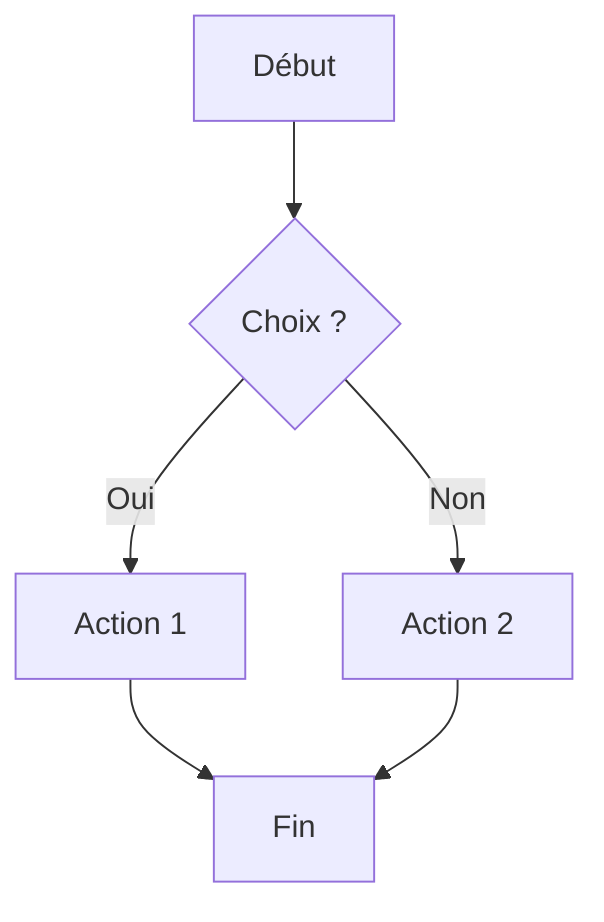

# Documentation du Markdown

<table><tr><td>

Le **Markdown** est un langage de balisage léger, volontairement simple et restreint, utilisé pour produire du contenu lisible qui sera ensuite rendu (documentation, README, notes, tickets, etc.), aussi bien côté outillage que côté affichage.
</td></tr></table>

## Sommaire

<details><summary class="button">🔍 Sommaire</summary><div class="spoiler">

- [Documentation du Markdown](#documentation-du-markdown)
  - [Sommaire](#sommaire)
  - [Syntaxe de base](#syntaxe-de-base)
    - [Retour à la ligne](#retour-à-la-ligne)
    - [Syntaxe des titres](#syntaxe-des-titres)
    - [Titre niveau 3 sympa avec lien](#titre-niveau-3-sympa-avec-lien)
    - [Commentaire invisible](#commentaire-invisible)
    - [Syntaxe des emphase (gras / italique)](#syntaxe-des-emphase-gras--italique)
    - [Syntaxe des liens](#syntaxe-des-liens)
    - [Syntaxe des images](#syntaxe-des-images)
    - [Image dans un lien](#image-dans-un-lien)
    - [Syntaxe des ancres (liens internes)](#syntaxe-des-ancres-liens-internes)
    - [Syntaxe de code inline](#syntaxe-de-code-inline)
    - [Syntaxe des séparateurs horizontaux](#syntaxe-des-séparateurs-horizontaux)
    - [Syntaxe d'échapement de caractères spéciaux](#syntaxe-déchapement-de-caractères-spéciaux)
  - [Coloration syntaxique des blocs de code](#coloration-syntaxique-des-blocs-de-code)
  - [Mermaid](#mermaid)
  - [Blocs en md](#blocs-en-md)
  - [Tableau](#tableau)
    - [Alignement dans les tableaux](#alignement-dans-les-tableaux)
  - [Les listes](#les-listes)
    - [Liste ordonnée](#liste-ordonnée)
    - [Points pleins](#points-pleins)
    - [Points vides](#points-vides)
  - [Usage avec VSC](#usage-avec-vsc)
    - [Réglages dans les options](#réglages-dans-les-options)
    - [Extensions VSC pour le MD](#extensions-vsc-pour-le-md)
    - [Générer un index/sommaire automatique sur VSC](#générer-un-indexsommaire-automatique-sur-vsc)
    - [Gestion avancée des listes et tableaux](#gestion-avancée-des-listes-et-tableaux)
    - [Prévisualisation et raccourcis clavier](#prévisualisation-et-raccourcis-clavier)
      - [Environnement mathématique](#environnement-mathématique)
    - [Gestion des images avec autocomplétion](#gestion-des-images-avec-autocomplétion)
  - [Autres](#autres)
    - [Footnotes](#footnotes)
    - [Emojis](#emojis)
    - [Autolinks](#autolinks)
    - [HTML inline complexe](#html-inline-complexe)
    - [Bloc de citation imbriqué multiple](#bloc-de-citation-imbriqué-multiple)
    - [Définitions de terme / Definition lists](#définitions-de-terme--definition-lists)
    - [Strikethrough](#strikethrough)
    - [Bloc de citation avec code et listes à l’intérieur](#bloc-de-citation-avec-code-et-listes-à-lintérieur)
  - [Upload d’images et vidéos sur GitHub](#upload-dimages-et-vidéos-sur-github)
    - [Exemple](#exemple)
    - [Mettre de la vidéo](#mettre-de-la-vidéo)
  - [Remonter la page](#remonter-la-page)
  - [Ajouter les contributeurs](#ajouter-les-contributeurs)
  - [Snippet markdown](#snippet-markdown)
    - [Spoil dans une doc interne](#spoil-dans-une-doc-interne)
    - [Spoil dans un readme](#spoil-dans-un-readme)
  - [Utiliser des badges sympa](#utiliser-des-badges-sympa)
  - [README de délégation](#readme-de-délégation)
  - [Auteur](#auteur)

</div></details>

## Syntaxe de base

<details><summary class="button">🔍 Spoiler</summary><div class="spoiler">

Ici nous allons voir quels sont les éléments de la syntaxe du MD.

### Retour à la ligne

Les retour à la ligne est spécial,
car ici, après mon retour chariot, le texte apparait toujours sur la même row !

Il faut utiliser deux espace `  `, en fin de ligne pour qu'il soit pris en compte  
Voilà, le texte apparaît normalement ! Pour faire un nouveau paragraphe, il suffit de faire 2 retours à la ligne.

Voilà un nouveau paragraphe.

### Syntaxe des titres

```md
# Titre niveau 1

## Titre niveau 2

### Titre niveau 3

### [Titre niveau 3 sympa avec lien](#titre-niveau-3-sympa-avec-lien)
```

### [Titre niveau 3 sympa avec lien](#titre-niveau-3-sympa-avec-lien)

Ici le titre est coloré !

### Commentaire invisible

```md
[//]: un-commentaire-caché
```

Ce qui donne (il faut un retour vide attention) :

[//]: un-commentaire-caché

### Syntaxe des emphase (gras / italique)

```md
- _italique_
- **gras**
- **_gras et italique_**
```

- _italique_
- **gras**
- **_gras et italique_**

### Syntaxe des liens

```md
[Texte du lien](https://example.com)
```

### Syntaxe des images

```md

```

### Image dans un lien

```md
[](https://github.com/matiassingers/awesome-readme)
```

Ce qui donne :
[](https://github.com/matiassingers/awesome-readme)

### Syntaxe des ancres (liens internes)

```md
[Aller au chapitre "Syntaxe des titres"](#syntaxe-des-titres)
```

Ce qui donne [Aller au chapitre "Syntaxe des titres"](#syntaxe-des-titres)

### Syntaxe de code inline

```md
`ceci est du code inline`
```

Ce qui donne `ceci est du code inline`

### Syntaxe des séparateurs horizontaux

```md
---
```

Ce qui donne

---

### Syntaxe d'échapement de caractères spéciaux

```md
\*ce texte n'est pas en italique\*
_ce texte est en italique_
```

Ce qui donne :

- \*ce texte n'est pas en italique\*
- _ce texte est en italique_

</div></details>

## Coloration syntaxique des blocs de code

<details><summary class="button">🔍 Spoiler</summary><div class="spoiler">

La coloration syntaxique n’appartient pas au Markdown standard : elle dépend du moteur de rendu (GitHub, GitLab, IDE, lecteur Markdown).

```html
<!DOCTYPE html>
<html>
  <head>
    <title>Test</title>
  </head>
  <body>
    <h1 style="color: blue;">Hello, world!</h1>
    <p style="color: green;">Ceci est un paragraphe coloré.</p>
  </body>
</html>
```

</div></details>

## Mermaid

<details><summary class="button">🔍 Spoiler</summary><div class="spoiler">

Mermaid n’est pas implémenté dans le Markdown standard, mais peut être utilisé via des extensions ou des lecteurs Markdown compatibles (GitHub, GitLab, Obsidian, etc.).



</div></details>

## Blocs en md

<details><summary class="button">🔍 Spoiler</summary><div class="spoiler">

Ces blocs ne font pas partie du Markdown standard ; ils sont interprétés par certains moteurs (GitHub, GitLab, Obsidian).

<!-- markdownlint-disable MD028 -->

> **Note**
> Une note basique, ne requiert aucun tag particulier, contrairement aux suivants

> [!TIP]
> Voici un bloc TIP. Utile pour donner un conseil ou astuce.

> [!NOTE]
> Ceci est un bloc NOTE. Pour ajouter des informations complémentaires.

> [!WARNING]
> Attention ! Ce bloc WARNING signale un danger ou une mise en garde.

> [!IMPORTANT]
> Ce bloc IMPORTANT met en avant une information cruciale.

> [!CAUTION]
> Ceci est un bloc de note simple pour ajouter des informations ou précisions.

<!-- markdownlint-enable MD028 -->

</div></details>

## Tableau

<details><summary class="button">🔍 Spoiler</summary><div class="spoiler">

Les tableaux sont une extension courante, mais absente du Markdown original.

|     | **Code**           | **Type** | **Table**            | **Contraintes** | **Descriptif**                         |
| --- | ------------------ | -------- | -------------------- | --------------- | -------------------------------------- |
| 🔴  | `user_id`          | UUID     | user                 | PK, NOT NULL    | Identifiant unique de l'utilisateur    |
| 🟠  | `role_id`          | INT      | roles                | PK, NOT NULL    | Identifiant unique du rôle             |
| 🟡  | `company_id`       | UUID     | companies            | PK, NOT NULL    | Identifiant unique de l'entreprise     |
| 🟢  | `audit_id`         | UUID     | audits               | PK, NOT NULL    | Identifiant unique de l'audit          |
| 🔵  | `observation_id`   | UUID     | audit_observations   | PK, NOT NULL    | Identifiant unique de l'observation    |
| 🟣  | `report_id`        | UUID     | audit_reports        | PK, NOT NULL    | Identifiant unique du rapport          |
| 🟤  | `certification_id` | UUID     | certifications       | PK, NOT NULL    | Identifiant unique de la certification |
| ⚫  | `order_id`         | UUID     | certification_orders | PK, NOT NULL    | Identifiant unique de la commande      |
| ⚪  | `document_id`      | UUID     | documents            | PK, NOT NULL    | Identifiant unique du document         |

Nous avons utilisé ces émoji pour remplacer la mise en style de couleur :  
🔴🟠🟡🟢🔵🟣🟤⚫⚪

### Alignement dans les tableaux

| Produit             |                  Description                   | Prix (€) |      Disponibilité |
| :------------------ | :--------------------------------------------: | :------: | -----------------: |
| Ordinateur portable |   Ultrabook 15" avec 16 Go RAM et SSD 512 Go   |   1200   |           En stock |
| Smartphone          |       Écran OLED 6,7", 256 Go, dual SIM        |   999    | Rupture temporaire |
| Casque audio        | Casque circum-aural, réduction de bruit active |   199    |           En stock |
| Souris gaming       |     RGB, 16000 DPI, boutons programmables      |    79    |           En stock |
| Clavier mécanique   |  Switches Cherry MX Red, rétro-éclairage RGB   |   129    |        Précommande |

- **Colonne 1** : alignée à gauche (`:---`)
- **Colonne 2** : centrée (`:---:`)
- **Colonne 3** : centrée (`:---:`)
- **Colonne 4** : alignée à droite (`---:`)

Le **`:---`** = gauche, **`:---:`** = centre, **`---:`** = droite.

</div></details>

## Les listes

<details><summary class="button">🔍 Spoiler</summary><div class="spoiler">

### Liste ordonnée

1. Un premier élément
2. Un second
3. Un troisième

Ou avec parenthèses :

1. Un premier élément
2. Un second
3. Un troisième

4. Élément
   1. Sous-élément 1
   2. Sous-élément 2
5. Élément 2

### Points pleins

On peut utiliser `-` ou `+`, il faut juste veiller à ne pas les mélanger

- Un élément
- Un élément
- Un élément

### Points vides

- Un élément
  - un sous-élément
- Un élément
  - un sous-élément
    - un sous-sous-élément
  - un sous-élément
- Un élément
  - un sous-élément

</div></details>

## Usage avec VSC

<details><summary class="button">🔍 Spoiler</summary><div class="spoiler">

Codium (ou Vscode) est l'IDE le plus puissant pour créer de la documentation en Markdown

### Réglages dans les options

Aller dans les options via `CTRL+,` et cliquer sur l’icône `Afficher les paramètres (en JSON)` (icône roue dentée chez moi)

```JSON
"[markdown]": {
  "editor.quickSuggestions": {
    "other": true,
    "comments": true,
    "strings": true
  },
  "editor.snippetSuggestions": "top",
  "editor.tabCompletion": "on"
},
"workbench.editorAssociations": {
  "*.md": "vscode.markdown.preview.editor"
},
"markdownlint.config": {
  "MD033": false
}
```

### Extensions VSC pour le MD

Voici ce que j'utilise

Nom : Markdown Preview Mermaid Support
ID : bierner.markdown-mermaid

Nom : Mermaid Markdown Syntax Highlighting
ID : bpruitt-goddard.mermaid-markdown-syntax-highlighting

Nom : markdownlint
ID : DavidAnson.vscode-markdownlint

Nom : Markdown All in One
ID : yzhang.markdown-all-in-one

Nom : Markdown Footnote
ID : houkanshan.vscode-markdown-footnote

### Générer un index/sommaire automatique sur VSC

Via `Ctrl+Shift+P` et on choisis `Markdown All in One : Create Table of Contents`

### Gestion avancée des listes et tableaux

Markdown All-in-One permet de :

- **Corriger automatiquement les numéros dans les listes ordonnées** lors de l’ajout ou suppression d’éléments.
- **Basculer facilement entre différents marqueurs de liste** (`-`, `+`, `1.`, `1)`).
- **Aligner proprement les tableaux** via le raccourci **<kbd>Ctrl</kbd> + <kbd>Shift</kbd>** + <kbd>I</kbd>

### Prévisualisation et raccourcis clavier

- **Raccourcis clavier pour formater rapidement le texte** : gras, italique, barré, titre, blocs de code, etc.
- **Toggle de l’environnement mathématique** : <kbd>Ctrl</kbd>/<kbd>Cmd</kbd> + <kbd>M</kbd>.
- **Gras** : <kbd>Ctrl</kbd> + <kbd>B</kbd>
- **Italique** : <kbd>Ctrl</kbd> + <kbd>I</kbd>
- **Barré** : <kbd>Alt</kbd> + <kbd>S</kbd>
- **Titre (niveau up)** : <kbd>Ctrl</kbd> + <kbd>Shift</kbd> + <kbd>]</kbd>
- **Titre (niveau down)** : <kbd>Ctrl</kbd> + <kbd>Shift</kbd> + <kbd>[</kbd>

#### Environnement mathématique

Ca permet d’écrire des formules en LaTeX _dans Markdown_.

- Inline : `$E = mc^2$` → rendu dans le texte.

$E = mc^2$

- Bloc `$$` :

```md
$$
\int_0^\infty e^{-x} dx = 1
$$
```

$$
\int_0^\infty e^{-x} dx = 1
$$

→ rendu centré sur sa propre ligne, pratique pour les équations longues.

### Gestion des images avec autocomplétion

- Saisie rapide des chemins d’images et fichiers depuis le projet.
- Propose automatiquement les fichiers présents dans le dossier, en respectant `search.exclude`.
- Exemple d’insertion :

```md

```

- L’extension complète le chemin du fichier et affiche un aperçu dans la prévisualisation.

</div></details>

## Autres

<details><summary class="button">🔍 Spoiler</summary><div class="spoiler">

### Footnotes

Voici un texte avec une note[^1].

[^1]: Ceci est le contenu de la note de bas de page.

### Emojis

Tu peux insérer directement des émojis Unicode dans le texte :

```md
Voici un texte avec un smiley 😄 et un cœur ❤️.
```

Voici un texte avec un smiley 😄 et un cœur ❤️.

### Autolinks

Markdown reconnaît les URLs entre `< >` automatiquement :

```md
Voici un lien automatique : <https://example.com>.
```

Voici un lien automatique : <https://example.com>.

### HTML inline complexe

Tu peux intégrer du HTML directement pour styliser ou structurer :

```md
<p>Texte en HTML inline</p>
<span>Texte via span</span>
```

<p>Texte en HTML inline</p>
<span>Texte via span</span>

Attention **le style et le script sont désactivés sur GitHub**.

### Bloc de citation imbriqué multiple

Pour des citations imbriquées ou longues :

```md
> Citation principale
>
> > Citation imbriquée
> >
> > > Encore une citation
```

> Citation principale
>
> > Citation imbriquée
> >
> > > Encore une citation

### Définitions de terme / Definition lists

Certains moteurs Markdown supportent les listes de définitions :

```md
Terme 1
: Définition du terme 1

Terme 2
: Définition du terme 2
```

Terme 1
: Définition du terme 1

Terme 2
: Définition du terme 2

### Strikethrough

Pour barrer du texte :

```md
~~Texte barré~~
```

### Bloc de citation avec code et listes à l’intérieur

On peut imbriquer code et listes dans un blockquote :

````md
> Voici une citation
>
> - Élément 1
> - Élément 2
>
> ```python
> print("Code dans la citation")
> ```
````

> Voici une citation
>
> - Élément 1
> - Élément 2
>
> ```python
> print("Code dans la citation")
> ```

</div></details>

## Upload d’images et vidéos sur GitHub

<details><summary class="button">🔍 Spoiler</summary><div class="spoiler">

1. Ouvrez le dépôt GitHub dans votre navigateur.
2. Cliquez sur l’onglet **Issues**, **Discussions**, ou une **Pull Request** existante.
3. Cliquez sur **New issue** pour ouvrir le formulaire de commentaire.
4. **Glissez-déposez votre fichier (PNG, GIF, MP4 ou SVG) directement dans la zone de texte**.
   - Les **GIF** sont animés mais ce ne sont **pas des vidéos**. Ils seront lus en boucle dans le README.
5. Attendez que GitHub termine l’upload : une **URL `github.com/user-attachments/...`** est générée automatiquement.
6. Copiez cette URL.
7. Collez-la dans votre `README.md` avec la syntaxe Markdown :

**Attention : les vidéos MP4 `user-attachments` ne sont lisibles que dans le README GitHub, pas dans une preview locale, seuls les images et GIF fonctionneront ainsi.**

```md

```

- Si nécessaire, vous pouvez ajuster la taille avec du HTML :

```html

```

Cela permet de l’intégrer proprement dans un tableau ou de limiter sa largeur.

- Vous pouvez **supprimer l’issue** une fois l’URL récupérée pour ne pas encombrer le dépôt.

**Résultat** : l’image ou GIF s’affiche dans le README, avec **tout le style intégré dans le fichier**, sans CSS ni Markdown avancé.

### Exemple

Voici un tableau existant avec des gif

```md
|       |    |
| :--------------------------------------------------------------------------------------------: | :-------------------------------------------------------------------------------------------: |
|     |  |
|  |     |
```

On va passer par du html pour les redimensionner

```md
|       |    |
| :------------------------------------------------------------------------------------------------------------------------: | :-----------------------------------------------------------------------------------------------------------------------: |
|     |  |
|  |     |
```

|       |    |
| :------------------------------------------------------------------------------------------------------------------------: | :-----------------------------------------------------------------------------------------------------------------------: |
|     |  |
|  |     |

### Mettre de la vidéo

```md
<video width="400" controls>
  <source src="assets/test.mp4" type="video/mp4">
  Votre navigateur ne supporte pas la vidéo.
</video>
```

Ce qui donne :

<video width="400" controls>
  <source src="assets/test.mp4" type="video/mp4">
  Votre navigateur ne supporte pas la vidéo.
</video>

Attention ça ne fonctionne pas sur le readme de github, il faut utiliser l'astuce que j'ai expliqué plus haut.

```md
[Watch the full demonstration of our application's features and gameplay](https://github.com/user-attachments/assets/25069b38-0d7d-47bb-bec5-01125281db57)
```

Voici ce que ça donnerait

[Watch the full demonstration of our application's features and gameplay](https://github.com/user-attachments/assets/25069b38-0d7d-47bb-bec5-01125281db57)

Comme expliqué, ça ne s'affichera que sur github

</div></details>

## Remonter la page

<details><summary class="button">🔍 Spoiler</summary><div class="spoiler">

Il faut bien choisir son encrage de son titre 1, ici c'est `#documentation-du-markdown`.

```md
<p align="right"><a href="#documentation-du-markdown">🔝 Retour en haut</a></p>
```

<p align="right"><a href="#documentation-du-markdown">🔝 Retour en haut</a></p>

</div></details>

## Ajouter les contributeurs

<details><summary class="button">🔍 Spoiler</summary><div class="spoiler">

Utiliser `https://contrib.rocks/image?repo=user/repo&max=500&columns=20&anon=1`, puis insérez-la ainsi

En remplaçant `account/repo`

```md
<a href="https://github.com/account/repo/graphs/contributors">
  
</a>
```

Par exemple ici, pour `refinedev/refine`

```md
<a href="https://github.com/refinedev/refine/graphs/contributors">
  
</a>
```

<details><summary class="button">🔍 Afficher pavé</summary><div class="spoiler">

Ce qui donne

<a href="https://github.com/refinedev/refine/graphs/contributors">
  
</a>

</div></details>

Cela affiche automatiquement les avatars des contributeurs du dépôt GitHub public en redirigeant sur la page correspondante.

</div></details>

## Snippet markdown

<details><summary class="button">🔍 Spoiler</summary><div class="spoiler">

Très utile pour faire un formatage dans une doc bien remplie.

Pour faire un snippet dans VSC `'CTRL+SHIFT+P'`\ `"Snippets configurer user snippet"`
Et choisissez le language `javascript/css/html/etc...`
Vous aurez à copier les blocs de code de cette doc au sein des objets, entre les accolades du fichier .json du langage sélectionné.

Pour des doc internes on peut utiliser du style pour faire des balises.

````json
{
  "Code block with language": {
    "prefix": "ycodeblock",
    "body": ["```$1", "$0", "```"],
    "description": "Insère un bloc de code avec le langage à saisir"
  },
  "Spoiler style perso": {
    "prefix": "xstyle",
    "body": [
      "<span hidden>",
      "<details><summary></summary>",
      "<style>.spoiler{border-left:4px solid #1abc9c;border-bottom-left-radius:3px;padding-left:10px;padding-top:15px;margin-top:-10px;margin-bottom:15px}.button{cursor:pointer;padding:5px 10px;background-color:#3498db;color:white;border-radius:3px;margin-bottom:5px;display:inline-block;transition:background-color 0.2s}.button:hover{background-color:#217dbb}details[open] .button{background-color:#1abc9c}</style>",
      "</details></span>",
      "",
      "<p align=\"right\"><a href=\"#$1\">🔝 Retour en haut</a></p>",
      ""
    ],
    "description": "Insertion du style et bouton up, remplir le titre 1 pour le bouton"
  },
  "Intro": {
    "prefix": "xintro",
    "body": [
      "<table><tr><td>",
      "",
      "$1",
      "</td></tr></table>"
    ],
    "description": "Insère un bloc d'intro"
  },
  "Spoiler collapsible contenu with style": {
    "prefix": "yspoiler",
    "body": [
      "<details><summary class=\"button\">🔍 Spoiler</summary><div class=\"spoiler\">",
      "",
      "$0",
      "",
      "</div></details>"
    ],
    "description": "Insère un spoiler collapsible avec curseur sur le contenu"
  },
  "Insert Author Block": {
    "prefix": "yauthorblock",
    "body": [
      "## Auteur",
      "",
      "[](https://github.com/RogerBytes)  ",
      "[**RogerBytes (Harry Richmond)**](https://github.com/RogerBytes)"
    ],
    "description": "Insère un bloc auteur avec avatar et nom cliquable"
  }
}
````

> [!WARNING]
> Corrige le snippet `Insert Author Block` pour y mettre ton nom de compte au lieu de `RogerBytes` ainsi que ton nom et prénom !

### Spoil dans une doc interne

Il suffit de mettre le style en bas de page en l'appellant avec `xstyle` (il mettra le style dans une balise), ensuite dans notre doc il suffit d'appeler avec `yspoiler`.

### Spoil dans un readme

Il suffit d'appeler avec `yspoiler`, on ne peut pas injecter de style dans un README, il ne sera donc pas décoré.

</div></details>

## Utiliser des badges sympa

<details><summary class="button">🔍 Spoiler</summary><div class="spoiler">

Pour faire les badges : <https://shields.io/>

</div></details>


## README de délégation

<details><summary class="button">🔍 Spoiler</summary><div class="spoiler">

On peut utiliser un lien raccourci, ici j'ai mis mon readme dans le dossier "docs"

```bash
ln -s docs/README.md README.md
```

Ici le fichier `README.md` à la racine n'est en réalité qu'un lien faire le fichier, avec le chemin relatif.

</div></details>

## Auteur

[](https://github.com/RogerBytes)  
[**RogerBytes (Harry Richmond)**](https://github.com/RogerBytes)

<span hidden>
<details><summary></summary>
<style>.spoiler{border-left:4px solid #1abc9c;border-bottom-left-radius:3px;padding-left:10px;padding-top:15px;margin-top:-10px;margin-bottom:15px}.button{cursor:pointer;padding:5px 10px;background-color:#3498db;color:white;border-radius:3px;margin-bottom:5px;display:inline-block;transition:background-color 0.2s}.button:hover{background-color:#217dbb}details[open] .button{background-color:#1abc9c}</style>
</details></span>

<p align="right"><a href="#documentation-du-markdown">🔝 Retour en haut</a></p>
